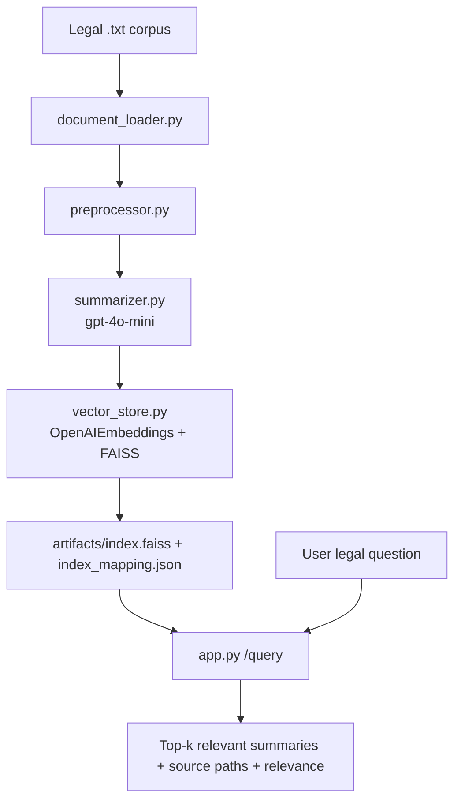

# RAG-Legal-Insight-Engine-

RAG Legal Insight Engine is a Python 3.11 Retrieval-Augmented Generation (RAG) system for legal corpora.
It recursively loads `.txt` legal files, cleans text, creates concise LLM summaries (≤100 words), embeds the summaries, and indexes them with FAISS for fast semantic retrieval.
The FastAPI endpoint is read-only and returns source-backed answers for legal questions.

## Scope

- Input format: plain text `.txt` files in one directory tree
- No OCR / PDF conversion / multi-language support
- Read-only API (no upload/edit endpoints)
- Designed for corpora with thousands of files

## Architecture



## Project Structure

```text
.
├── app.py
├── document_loader.py
├── preprocessor.py
├── summarizer.py
├── vector_store.py
├── run_pipeline.py
├── evaluate_precision.py
├── requirements.txt
├── .env.example
└── tests/
```

## Setup

1. Create and activate a Python 3.11 virtual environment.
2. Install dependencies:

```bash
pip install -r requirements.txt
```

1. Set environment variables:

```bash
copy .env.example .env
# then set OPENAI_API_KEY in .env
```

## Build Index (End-to-End Pipeline)

```bash
python run_pipeline.py --data-dir "path/to/legal_corpus" --artifacts-dir artifacts
```

Expected behavior:

- Loader logs discovered `.txt` count and loaded count
- Summaries are generated with a hard cap of 100 words
- FAISS index and mapping files are persisted under `artifacts/`

## Run API

```bash
uvicorn app:app --host 0.0.0.0 --port 8000
```

Query endpoint:

```http
POST /query
Content-Type: application/json

{
  "question": "What are the termination obligations in this contract set?",
  "top_k": 3
}
```

Sample response shape:

```json
{
  "question": "...",
  "answers": [
    {
      "summary": "...",
      "source_path": "...",
      "relevance_score": 0.87
    }
  ],
  "latency_ms": 145.12
}
```

## Precision Evaluation (10 Query Test Set)

Create a JSON file like:

```json
[
  {
    "question": "What does the lease say about termination notice?",
    "expected_source_contains": "lease"
  }
]
```

Run:

```bash
python evaluate_precision.py --queries-file path/to/labeled_queries.json --top-k 3
```

Target metric: Precision > 80% across 10 legal test queries.

## Testing

Run unit and integration tests:

```bash
pytest -q
```

## Design Decisions

- Summary-first embeddings to reduce token volume and improve retrieval speed
- FAISS `IndexFlatL2` for simple, deterministic nearest-neighbor search
- JSON mapping file for transparent vector ID → source traceability
- FastAPI app factory (`create_app`) for easier testing and dependency injection
- Strict focus on `.txt` corpus and read-only query API to keep scope minimal
